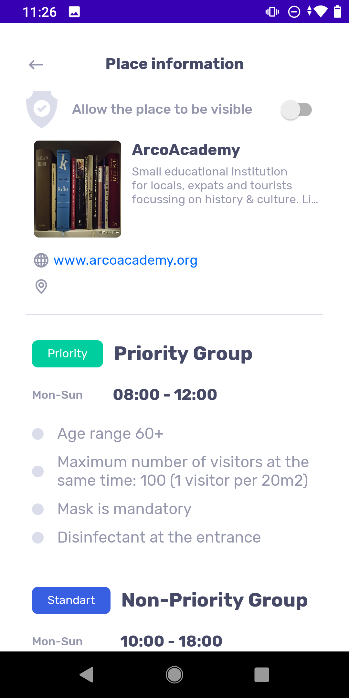
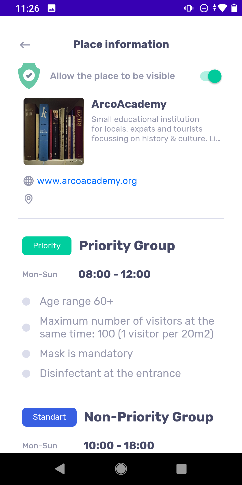

# AccessApp Administrator

AccessApp follows a mobile first and currently a mobile only approach.

## Introduction

AccessApp Administrator allows review and enabling of added Places and suspension of Places, that violate the Rules.

## Process

When a Place is added, it appears under the Not Approved in the AccessApp Administrator.

Tapping on the Place shows the Place details and allows approval.

A Place is approved by swping the approve control top right.

...

