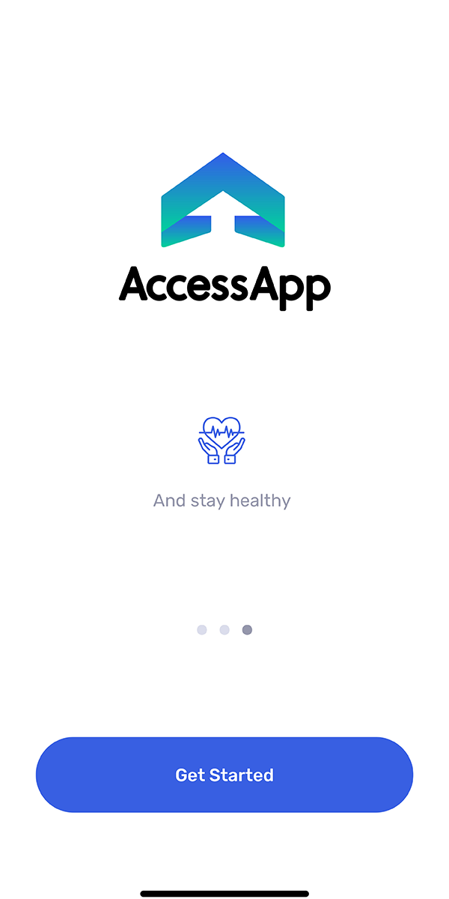

# Information and Implementation Guide for Places

## What is AccessApp?

AccessApp is a research-informed, not-for-profit booking and discovery platform to allow venues, businesses, attractions and spaces to safely provide uncrowded access to indoor and outdoor spaces thereby protecting the public's health whilst promoting public health information and encouraging the sharing of public health best practice.

Designed as a forward looking, preventative solution in response to the COVID-19 pandemic our project will be led by public health needs and the needs of the wider economy and its functionality and health information will be updated continuously in alignment with the latest government health policy and best practice from industry bodies.

AccessApp is paired with AccessApp Places app which is used by the venues managers to add their 'Place' to the platform and specify their opening and visiting information, their COVID policies and additional saftey precautions in place. The AccessApp Places app also allows create and edit specific timeslots for thier visitors and allows the creation of slots with reduced and managed capacity specifically for those that are vulnerable and shielding as well as managed slots for previously crowded and unmanaged venues, places and spaces to help protect the wider public from COVID exposure.

AccessApp is designed so that venues and venues can add themselves to the platform easily and adopt the system easily within their organisation. Together with this Installation document and accompaniying video there is also a guided walk-thru when you first install the AccessApp Places app which helps you through the process.

> Charlie, we have to say it is free for all and open source.
> move the About into README and here only places

### Where do we come from?

The AccessApp idea was born from an [article](https://voxeu.org/article/easing-lockdown-digital-applications-can-help) published on 1 May 2020 and written by Alice Mesnard and Paul Seabright. The idea was recognised by T.E. Shaw from the [Linux Foundation Publish Health](https://www.lfph.io) and a pilot implementation done w/ the help of Charlie Cox from Digytle and a crew from Aux Nederland B.V.

> Charlie, we must link the wwws

### Wikipedia Operational Model (Open Source and Free For ALl)

AccessApp differs from the commercial booking apps in three ways.

* It is open source.
* It is free for all (funded through crowd donations and public funding)
* It focuses on the needs of Places and visitors prioritising public health and the needs of marginal groups, focusing on the value creation, regardless of the commercial value.

### Benefits for Places

#### Manage the flow of visitors

AccessApp allows Places to manage the flow of visitors in previosly unmanaged, crowded venues, spaces and attractions. It focuses on the needs of these Places while prioritsing the health and peace of mind of their Visitors and the wider public. AccessApp has specific functionality to address the needs of marginal groups of visitors such as of the Clinically Extremely Vulnerable (CEV), the elderly and those with underlying health conditions or shielding due to continued contact vulnerable family or friends.

> Charlie, AA has the goal to become Wikipedia of Access, while at the same time cooperate w/ existing IT vendors, allowing them to focus on added value elsewhere.

#### Free and Open Source 

AccessApp is open source and is free to use for both venues which means no financial burden for venues adopting the platform and no issues with vendor lock. It also means  extensive, comprehensive material and voluntary support is avaiable to venues requiring assistense installing and adapting system.

> Charlie, AA has the goal to become Wikipedia of Access, while at the same time cooperate w/ existing IT vendors, allowing them to focus on added value elsewhere (we should repeat this everywhere, because it is important).

#### Marketing

AccessApp helps visitors to search for and discover venues, spaces and attractions that have put in place measures to mitagate public exposure to COVID-19 by managing their visitor flow with timeslots and providing special timeslots with reduced capacity for those that are vulnerable and sheiding. Reaching out and supporting these.

> Charlie, this work in parallel w/ other methods of marketing and booking: AA will promote this plurality.

### Benefits for Visitors

#### Focused on their needs

- AccessApp is free
- There are no ads
- The focus is on the needs of the visitors, also on the needs of the vulnerable and marginalised groups

#### Discovery of Places which take Covid Seriously

AccessApp helps Visitors not only discover places and book safely, but also see what care the places take of their visitors.

> Tripadvisor is quite ahead in this, we should see our added value.

#### Queue Free Visiting

AccessApp allows Visitors to come right at the time of their slot, instead of be surprised by a queue and having to wait.

> Many AccessApp features are offered by commercial solutions: we must continuously remind that AccessApp is free and open source and focued on the needs of everybody, including marginal groups, where there commercial solution might be less interested or able to serve.

#### In Advance or AdHoc Booking

AccessApp allows in-advance-planning as well as adhoc-planning. In the first case one plans visits days or weeks in advance. In the second case one can plann a visit in-passing-by. This fits well into the senario where AccessApp isn't fully introduced to the Place and Visitors can download it at the entrance (in case the Place is currently full) and immediately book a visit for a later time on the same day, knowing they have guaranteed access.

> We need to solve the issue of avoiding abuse: eg. booking a slot and not showing up, which ticket sale handles better.

## Implementation Process

This chapter describes the current implementation process of AccessApp at a venue. 

It is important to understand, that AccessApp is driven by place-centricity and visitor-centricity and the AccessApp crew and community are focused on identifiying the needs of the venues and supporting the fast implentation of these adaptations so we can quicky build bespoke functionaility. This functionality can then be built into the system for other venues to use.

### What does it cost to the place

free to adapt and use

only minimum involvement of the place

* top management support
* curator supervison
* we take all the work from you which can be done externally
** we find, involve and organise volunteers

### Open Source and Free for All

outline the benefits

no vendor lock

true focus on the needs of the places and visitors, especially of marginalised groups w/o business case for commercial vendors

### Integration into the Total Visitory Flow Manaement incl. Marketing, Promotion, planning, hygene concept, statistics, etc.

All integrations will be managed externally by the AccessApp team and delivered by our development team pro bono. 

### Visitor and Place Journeys

AccessApp supports all Visitor and Place journeys.

#### 1. 100% AccessApp based (Places and Visitors)

- Places use the app to advertise themselves and their slots and conditions.
— Visitors use the app to book and enter.

#### 1a Visitor arrives at the door and has no app.

2. 50% AccessApp based (Places)

3. 50% AccessApp based (analogue Visitor, Places is integrated)

4. 0% AccessApp (analogue visitor, Places is integrated)

#### Cooperation w/ Existing IT Vendors

The existing IT vendors are an integral part of the AccessApp ecosystem. AccessApp aims at supporting existing IT vendors, not competing w/ them or replacing them.

AccessApp supports integration w/ booking/ticketing systems.

AccessApp handles all the functionality these system cannot handle.

## Apps

The AccessApp system consists of two apps 

AccessApp Visitor provides the Visitor experience.

AccessApp Places allows venues to add and edit themselves.

### PlacesApp

add video how to add and manage your place and also screenshots

## Initial Implementations and related Case Studies

### Implementation/Case Study #1 (Caricature Museum Frankfurt)

The opening is on 1 October 2020.

The challenge:

- outdoor area
- indoor area

Current possibility:

- each area is advertised as a Place 
- Visitors book independently slots for each Place (in advance or ad hoc) 
- there are checkin/checkout points into/out of each Place (we need to complete the bardcode part) 

Unresolved questions:

- how to handle the visitors w/o apps? 
  - one possibility is to have people to tap in/out button on the app 
    - this way human error as to the actual count can sneak in 
      - how critical would that be? 

### Implementation/Case Study #2 (Jewish Museum Frankfurt)

### Implementation/Case Study #3 (Guenther Krumpak, Prague)

spontatneous tours

expatcommunity

facebook events sends to booking places, but you have no idea of # of people, size of place, restaurants book table, guenther knows institutions, jewish museum in prague could be interested ! museum, cemitery and three sinagogues => perfect use case for spontaneous booking, logic for linked places that you cannot book two at the same time (justice) => tell Rosa for the ; can help w/ institutions too!; the national museum has 5 different buildins in prague, the national gallery has 5 different buildings also; 

guenther as representative

Deutch Tschechichesr Zukunftsfonds http://www.fondbudoucnosti.cz/de/ we need a person who does the writing, guenther can revive his IT connections, Expat Centr in Brno, IT faculty in Masaric univserity in Brno

facebook can connect to organiser=> to explore the API

like the facebook "check in at place" => we can link to that too :) 

we can incorporate a paying function

mapy.cz => they have an app where you can participate in recognising covid problematic places, much better than google maps in prague, better than google street view

goout.cz

ticketpro

completely anonymous, no statistics gathered (no need), no data capitalism

trafic light system

Next steps

- think of customer journey
-- think of target group: Use Case. Somebody together w/ people, moving around.  Teacher w/ their class going somewhere. University excursions. The unknown prague organisation, hospitals, seniors residences
- see what adaptations will be needed in the app
- look for somebody to help w/ grants in CZ
- check crowdfunding / donations 
- Guenther Can be ambassador for Prague, CZ
- help ArcoAcademy w/ logo via Eli
